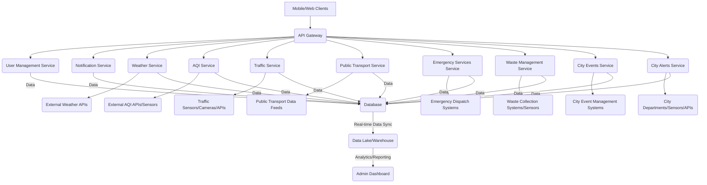

# Smart-City-Hub

# Smart City Application: High-Level Design (HLD)

## 1. Introduction

This document provides a High-Level Design (HLD) for a Smart City application. The aim is to create a centralized platform that provides citizens with real-time information and services related to their urban environment. This HLD outlines the major components, their interactions, and the overall architectural considerations for such an application.

## 2. Overall Architecture

The Smart City application will follow a **microservices-oriented architecture**, allowing for independent development, deployment, and scaling of individual components. A central **API Gateway** will manage requests from client applications (mobile/web) and route them to the appropriate backend services. Data will be collected from various sources, processed, and stored in a unified data layer.

## Key Architectural Layers:
**Client Layer :** Mobile (iOS/Android) and Web applications for user interaction.

**API Gateway Layer:** Single entry point for all client requests, handling authentication, rate limiting, and request routing.

**Microservices Layer:** Independent services for each functional component.

**Data Ingestion Layer:** Mechanisms to collect data from various internal and external sources.

**Data Storage Layer:** Databases (relational, NoSQL) and Data Lake/Warehouse for persistent storage and analytics.

**Notification Layer:** Push notification and messaging services for alerts.

## 3. Core Components
### 3.1. Weather Service

Description: Provides real-time and forecasted weather conditions for specific city locations.

Data Points: Temperature, humidity, wind speed/direction, precipitation, atmospheric pressure, UV index.

Functionality:

Fetch current weather data.

Provide hourly and daily forecasts.

Support location-based weather information.

Data Sources: Third-party weather APIs (e.g., OpenWeatherMap, AccuWeather), city-owned weather stations.

### 3.2. Air Quality Index (AQI) Service
Description: Displays current AQI levels and details about pollutants.

Data Points: AQI value, concentration of PM2.5, PM10, O3, CO, SO2, NO2.

Functionality:

Retrieve real-time AQI data for different city zones.

Provide historical AQI data.

Offer health advisories based on AQI levels.

Data Sources: City environmental sensors, national/international AQI monitoring networks.

### 3.3. Traffic Service
Description: Provides real-time traffic conditions, congestion information, and estimated travel times.

Data Points: Traffic flow, road closures, accidents, construction zones, average speeds.

Functionality:

Visualize traffic on a map.

Calculate optimal routes based on current traffic.

Alert users to significant traffic incidents.

Data Sources: Traffic cameras, road sensors, GPS data from vehicles, third-party APIs.

### 3.4. Public Transport Service
Description: Offers real-time info on public transport (bus, metro, tram).

Data Points: Arrival/departure times, real-time locations, route maps, service disruptions.

Functionality:

Display nearby stops and stations.

Track vehicles in real-time.

Provide journey planning.

Notify users of delays or cancellations.

Data Sources: GTFS-Realtime feeds, public transport operator APIs.

### 3.5. Emergency Services Service
Description: Provides quick access to emergency contacts and nearby facilities.

Data Points: Emergency contacts, locations of hospitals, police, fire stations.

Functionality:

One-tap emergency calling.

Display nearest facilities on a map.

Provide first-aid/safety guidelines.

Data Sources: Local government directories, emergency databases.

### 3.6. Waste Management Service
Description: Report waste-related issues and view collection schedules.

Data Points: Collection schedules, reported incidents, smart bin levels.

Functionality:

Report illegal dumping or full bins.

View collection schedules.

Locate recycling points.

Data Sources: Waste management databases, smart bin sensors.

### 3.7. City Events Service
Description: Calendar and directory of local events.

Data Points: Event details (name, date, time, location, etc.).

Functionality:

Browse events by filters.

Add events to personal calendars.

Receive notifications.

Data Sources: Tourism boards, local organizers, portals.

### 3.8. City Alerts Service
Description: Real-time critical city alerts.

Data Points: Alert type, description, affected areas, duration, source.

Functionality:

Push notifications.

Display active alerts.

Show official updates.

Data Sources: Emergency systems, police, utilities, weather departments.

## 4. Data Sources and Ingestion

APIs: Weather, Traffic, Transport APIs.

Sensors: AQI, Traffic, Waste sensors.

Databases: Government department databases.

Feeds: Real-time GTFS feeds, webhook integrations.

Manual Input: Admin portal for officials.

Data Ingestion Mechanisms:
Scheduled Batch Processing

Real-time Streaming: Kafka, RabbitMQ

Webhooks/Push Notifications

## 5. User Interface (UI) Considerations
Dashboard: Personalized view (weather, AQI, traffic, alerts).

Map Views: Traffic, transport, alerts, emergency services.

Search/Filters: Quick access to relevant data.

Notifications: Configurable push alerts.

Accessibility: High contrast, screen reader-friendly.

Mobile-First Design: Optimized for mobile, responsive.

## 6. Key Technologies (High-Level)
Backend:
Languages: Python (Django/Flask), Node.js, Java (Spring Boot)

Orchestration: Docker, Kubernetes

API Gateway: Nginx, Kong, AWS/GCP API Gateway

Message Queue: Kafka, RabbitMQ, Google Pub/Sub

Databases:
Relational: PostgreSQL, MySQL

NoSQL: MongoDB, Cassandra

Geospatial: PostGIS

Frontend:
Web: React, Angular, Vue.js

Mobile: React Native, Flutter, Swift (iOS), Kotlin/Java (Android)

Others:
Cloud: AWS, GCP, Azure

Maps: Google Maps API, OpenStreetMap, Mapbox

## 7. Scalability and Security Considerations
### 7.1. Scalability
Microservices-based scaling

Load balancing and auto-scaling

Caching and CDN

### 7.2. Security
OAuth 2.0 / JWT authentication

Role-based access control

Data encryption (SSL/TLS)

API security (rate limiting, validation)

Regular security audits

GDPR and data privacy compliance

OWASP secure coding practices

