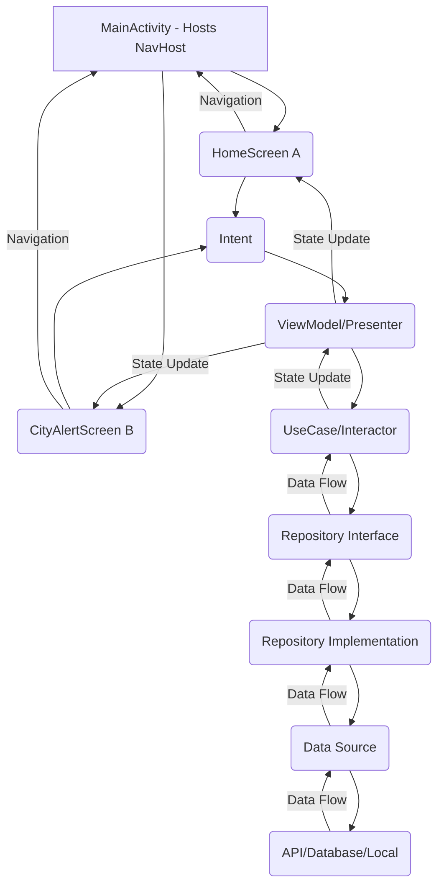

# Android Application: High-Level Design (HLD)  
### MVI and Clean Architecture (Single Activity & Jetpack Compose)

---

## 1. Introduction

This document outlines the High-Level Design (HLD) for an Android application, emphasizing the integration of the **Model-View-Intent (MVI)** architectural pattern with **Clean Architecture** principles. The architecture is tailored for a **Single-Activity** design using **Jetpack Compose** for UI development. The goal is to ensure scalability, testability, maintainability, and separation of concerns using unidirectional data flow.

---

## 2. Architectural Overview: MVI with Clean Architecture

The application is structured around **three primary layers**:
- **Presentation Layer**
- **Domain Layer**
- **Data Layer**

MVI governs the interaction between UI and business logic in the Presentation Layer. The UI is hosted in a single `MainActivity` using Jetpack Compose's `Navigation` component.




## Key Principles

- **Single Activity:** One `MainActivity` hosts all screens.
- **Jetpack Compose:** Declarative UI toolkit.
- **Navigation Compose:** Handles screen transitions.
- **Separation of Concerns:** Clear layer responsibilities.
- **Dependency Rule:** Outer layers depend on inner layers only.
- **Testability:** Components can be tested in isolation.
- **Maintainability:** Minimal impact of changes across layers.
- **Unidirectional Data Flow:** Intents → State → UI updates.

---

## 3. Architectural Layers

### 3.1. Presentation Layer (UI Layer)

Handles user interaction and UI rendering.

#### MainActivity

- **Responsibility:** Entry point. Hosts NavHost and manages navigation.
- **Component:** `ComponentActivity`.

#### Composable Screens

- **Responsibility:** Display `ViewState`, collect user inputs, emit `Intents`.
- **Component:** `@Composable` functions (e.g., `WeatherScreen`, `AQIScreen`).
- **Notes:** Stateless in terms of business logic.

#### Reusable Composables

- **Responsibility:** Small, reusable UI elements.
- **Examples:** `LoadingIndicator`, `WeatherCard`, `ErrorDialog`.

#### Intent

- **Responsibility:** Represents a user action.
- **Example:** `LoadWeatherIntent`, `ClickForecastIntent`.

#### ViewState

- **Responsibility:** Immutable state of UI.
- **Example:**

```kotlin
data class WeatherViewState(
  val isLoading: Boolean,
  val weatherData: Weather?,
  val error: Throwable?
)
```

ViewModel (Presenter)
Responsibility: Receives Intent, triggers UseCase, emits ViewState.

Component: AndroidX ViewModel.

### 3.2. Domain Layer (Business Logic Layer)

```
Framework-independent core logic.

Use Cases (Interactors)
Responsibility: Execute business logic.

Examples: GetWeatherUseCase, ReportWasteUseCase.

Entities
Responsibility: Core data models.

Examples: Weather, AQIData, CityAlert.

Repository Interfaces
Responsibility: Define data contracts.

Examples: WeatherRepository, AQIRepository.
```

### 3.3. Data Layer (Infrastructure Layer)

```
Handles data persistence and networking.

Repository Implementations
Responsibility: Implement domain interfaces.

Examples: WeatherRepositoryImpl.

Data Sources
Types:

Remote: e.g., Retrofit for APIs.

Local: e.g., Room DB, SharedPreferences.

Cache: In-memory/disk cache.

DTO Models
Responsibility: API or DB-specific models.

Note: Mapped to/from domain Entities.
```

## 4. Data Flow (MVI Cycle)

```
text
Copy
Edit
User Interaction → Intent → ViewModel → UseCase → Repository → Data Source → Result → ViewState → UI
Steps:
User Interaction: Composable captures event (e.g., button click).

Intent Emission: Emits a sealed class Intent.

ViewModel: Processes Intent → Updates isLoading → Invokes UseCase.

UseCase: Executes logic, accesses Repository.

Repository: Calls Data Source → Fetches/updates data.

State Update: ViewModel creates new ViewState.

UI Update: Composable observes and recomposes based on state.
```

## 5. Component Breakdown (Smart City App Mapping)

Applying this architecture to the Smart City application:

```
### Main Activity:
MainActivity will host the NavHost and define the navigation graph for all screens.

### Weather Feature:
**Composable Screen:** WeatherScreen (emits WeatherIntents via callbacks, observes WeatherViewState).
**ViewModel**: WeatherViewModel (processes WeatherIntents, exposes WeatherViewState).
**Use Case:** GetCurrentWeatherUseCase, GetWeatherForecastUseCase.
**Repository Interface:** WeatherRepository.
**Repository Implementation:** WeatherRepositoryImpl (calls WeatherRemoteDataSource, WeatherLocalDataSource).
**Data Sources:** WeatherRemoteDataSource (Retrofit for external API), WeatherLocalDataSource (Room DB for caching).
**Entities:** Weather, Forecast.

###  AQI Feature: Similar structure with AQIScreen, AQIViewModel, GetAQIUseCase, AQIRepository, etc.
###  City Alerts Feature:
  **Composable Screen:** AlertsScreen (emits AlertsIntents, observes AlertsViewState).
  **ViewModel**: AlertsViewModel.
  **Use Case:** GetCityAlertsUseCase, AcknowledgeAlertUseCase.
  **Repository Interface:** AlertsRepository.
  **Repository Implementation:** AlertsRepositoryImpl.
  **Data Sources:** AlertsRemoteDataSource (API for real-time alerts).
  **Entities:** CityAlert.
```

## 6. Key Technologies (Android Specific)

```
Category	Tech Stack
Language	Kotlin
UI Toolkit	Jetpack Compose
Navigation	Navigation Compose
Dependency Injection	Hilt
Async Ops	Kotlin Coroutines + Flow
Networking	Retrofit, OkHttp
Database	Room
Image Loading	Coil, Glide
```

## 7. Scalability and Maintainability Benefits

```
Simplified Lifecycle: Single Activity = fewer lifecycle bugs.

Faster UI Dev: Compose supports previews and quick iterations.

Reusable UI: Compose encourages reusable components.

Separation of Concerns: Clear boundaries by layer.

Parallel Dev: Teams can build features independently.

Testability: Unit test each layer in isolation.

Flexibility: Easily replace or swap data implementations.

Robust State: MVI’s immutable state is predictable and traceable.
```
